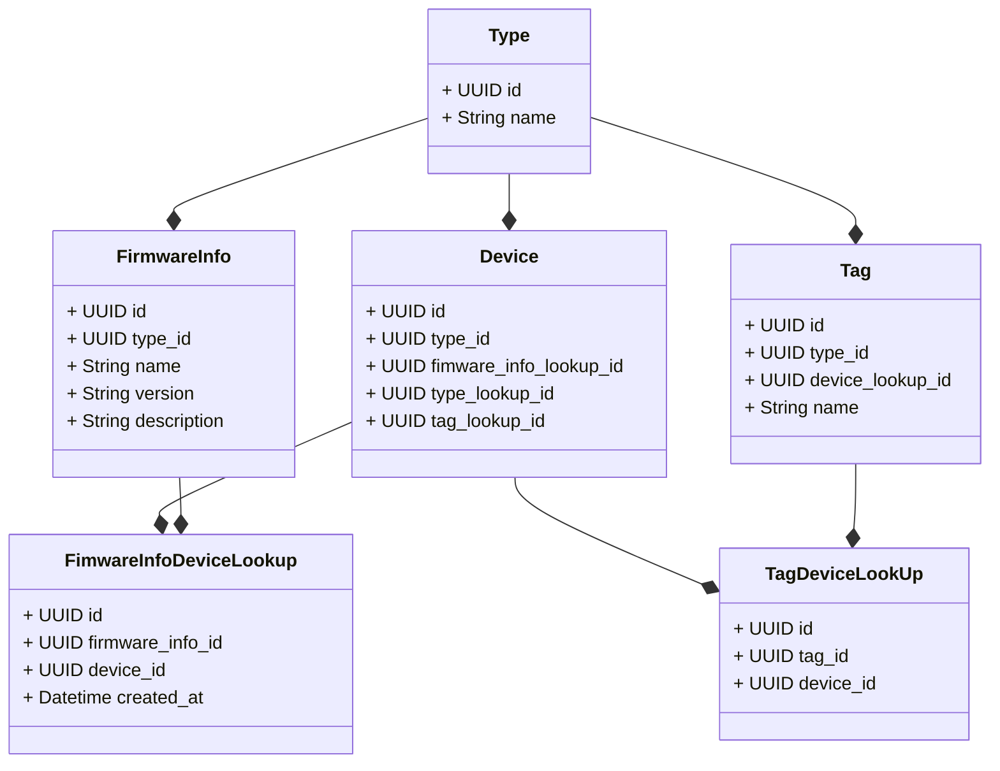

```mermaid
classDiagram
    class Type {
        + UUID id
        + String name
    }
    class FirmwareInfo {
        + UUID id
        + UUID type_id
        + String name
        + String version
        + String description
    }
    class Tag {
        + UUID id
        + UUID type_id
        + UUID device_lookup_id

        + String name
    }
    class Device {
        + UUID id
        + UUID type_id
        + UUID fimware_info_lookup_id
        + UUID type_lookup_id
        + UUID tag_lookup_id
    }
    class TagDeviceLookUp {
        + UUID id
        + UUID tag_id
        + UUID device_id
    }
    class FimwareInfoDeviceLookup {
        + UUID id
        + UUID firmware_info_id
        + UUID device_id

        + Datetime created_at
    }

    Type --* FirmwareInfo
    Type --* Tag
    Type --* Device

    Device --* TagDeviceLookUp
    Tag --* TagDeviceLookUp

    Device --* FimwareInfoDeviceLookup
    FirmwareInfo --* FimwareInfoDeviceLookup

```
