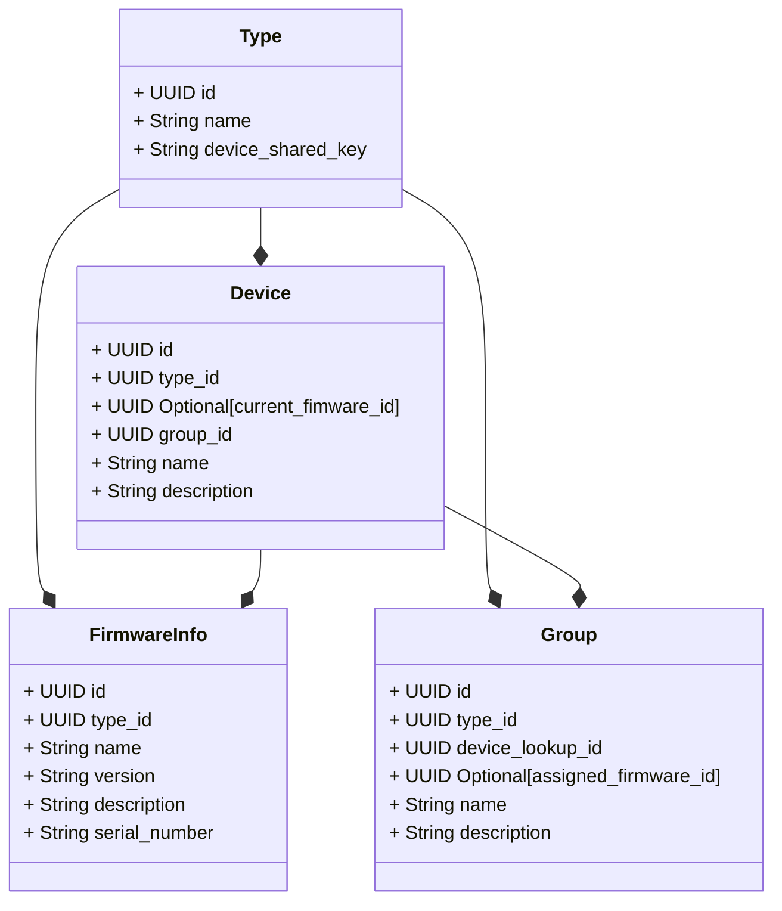

```mermaid
classDiagram
    class Type {
        + UUID id
        + String name
        + String device_shared_key
    }

    class FirmwareInfo {
        + UUID id
        + UUID type_id
        + String name
        + String version
        + String description
        + String serial_number
    }

    class Group {
        + UUID id
        + UUID type_id
        + UUID device_lookup_id
        + UUID Optional[assigned_firmware_id]
        + String name
        + String description
    }

    class Device {
        + UUID id
        + UUID type_id
        + UUID Optional[current_fimware_id]
        + UUID group_id

        + String name
        + String description
    }

    Type --* FirmwareInfo
    Type --* Group
    Type --* Device

    Device --* Group
    Device --* FirmwareInfo
```
