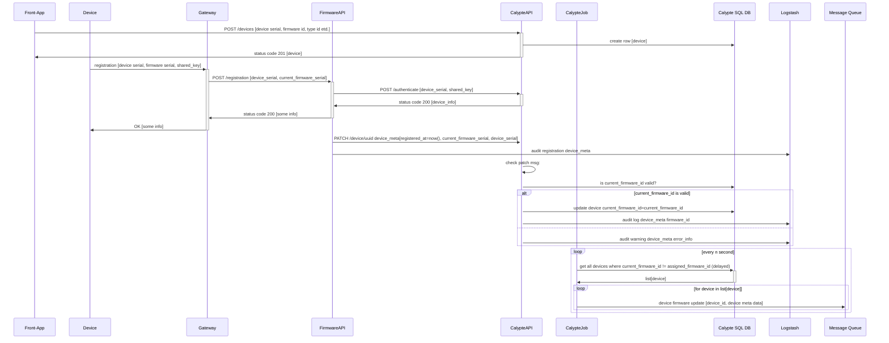

# registration flow

```mermaid
sequenceDiagram
    participant front as Front-App
    participant device as Device
    participant gateway as Gateway
    participant firmware_api as FirmwareAPI
    participant calypte_api as CalypteAPI
    participant calypte_job as CalypteJob
    participant calypte_db as Calypte SQL DB
    participant elk as Logstash
    participant MQ as Message Queue
    %% Use case: User registers a device and all is valid

    %% User registers device via web page
    front ->>+ calypte_api: POST /devices [device serial, firmware id, type id etd.]
    calypte_api ->> calypte_db: create row [device]
    calypte_api ->>- front: status code 201 [device]
    %% device registers to the platform
    device ->>+ gateway: registration [device serial, firmware serial, shared_key]
    gateway ->>+ firmware_api: POST /registration [device_serial, current_firmware_serial]
    %% authenticate device
    firmware_api ->>+ calypte_api: POST /authenticate [device_serial, shared_key]
    calypte_api ->>- firmware_api: status code 200 [device_info]
    firmware_api ->>- gateway: status code 200 [some info]
    gateway ->>- device: OK [some info]

    %% update model of the device
    firmware_api ->>+ calypte_api: PATCH /device/uuid device_meta[registered_at=now(), current_firmware_serial, device_serial]
    firmware_api ->> elk: audit registration device_meta  

    calypte_api ->> calypte_api: check patch msg:
    calypte_api ->> calypte_db: is current_firmware_id valid?
    alt current_firmware_id is valid
        calypte_api ->> calypte_db: update device current_firmware_id=current_firmware_id
        calypte_api ->> elk: audit log device_meta  firmware_id
    else
        calypte_api ->> elk: audit warning device_meta  error_info
    end

    loop every n second
        calypte_job ->>+ calypte_db: get all devices where current_firmware_id != assigned_firmware_id (delayed)
        calypte_db ->>- calypte_job: list[device]
        loop for device in list[device]
            calypte_job ->> MQ: device firmware update [device_id, device meta data]
        end
    end
```
